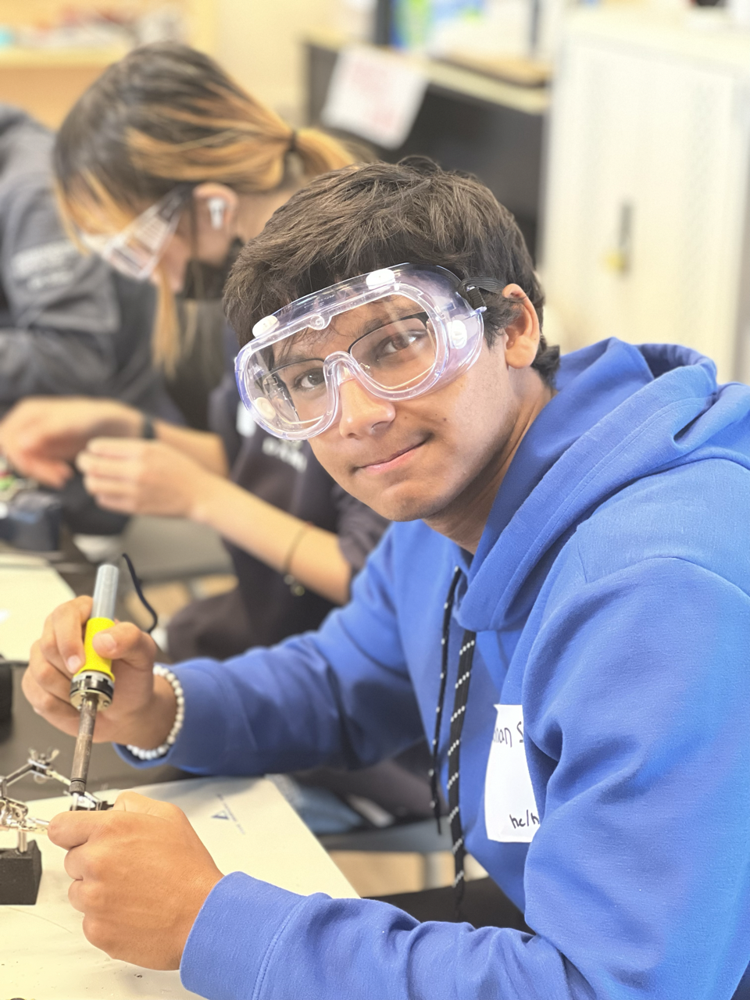

# Blue Stamp Engineering Third Eye for The Blind
<!---
Replace this text with a brief description (2-3 sentences) of your project. This description should draw the reader in and make them interested in what you've built. You can include what the biggest challenges, takeaways, and triumphs from completing the project were. As you complete your portfolio, remember your audience is less familiar than you are with all that your project entails!
-->
| **Engineer** | **School** | **Area of Interest** | **Grade** |
|:--:|:--:|:--:|:--:|
| Nabhan S | Design Tech High School | Electrical Engineering | Incoming Sophmore
<!---
**Replace the BlueStamp logo below with an image of yourself and your completed project. Follow the guide [here](https://tomcam.github.io/least-github-pages/adding-images-github-pages-site.html) if you need help.**
-->

  
# Final Milestone
<!---
For your final milestone, explain the outcome of your project. Key details to include are:
- What you've accomplished since your previous milestone
- What your biggest challenges and triumphs were at BSE
- A summary of key topics you learned about
- What you hope to learn in the future after everything you've learned at BSE

**Don't forget to replace the text below with the embedding for your milestone video. Go to Youtube, click Share -> Embed, and copy and paste the code to replace what's below.**

<iframe width="560" height="315" src="https://www.youtube.com/embed/F7M7imOVGug" title="YouTube video player" frameborder="0" allow="accelerometer; autoplay; clipboard-write; encrypted-media; gyroscope; picture-in-picture; web-share" allowfullscreen></iframe>
-->
# Second Milestone
<!---
For your second milestone, explain what you've worked on since your previous milestone. You can highlight:
- Technical details of what you've accomplished and how they contribute to the final goal
- What has been surprising about the project so far
- Previous challenges you faced that you overcame
- What needs to be completed before your final milestone 

**Don't forget to replace the text below with the embedding for your milestone video. Go to Youtube, click Share -> Embed, and copy and paste the code to replace what's below.**

<iframe width="560" height="315" src="https://www.youtube.com/embed/y3VAmNlER5Y" title="YouTube video player" frameborder="0" allow="accelerometer; autoplay; clipboard-write; encrypted-media; gyroscope; picture-in-picture; web-share" allowfullscreen></iframe>
-->
# First Milestone: Breadboard Prototype

There are 7 different parts. 
-  A slide switch: a switch that slides between 2 settings and I use it to switch between the buzzer and the motor.
-  LED: a semiconductor device that emits light when current flows through it and is used to indicate if the circuit is working.
-  200 ohms resistor: a  resistor that limits the flow of electrons through a circuit to around 200 ohms.
-  ultrasonic sensor: an electronic device that measures the distance of a target object by emitting ultrasonic sound waves and converts the reflected sound into an electrical signal. Then those signals are used to turn on either the buzzer or the motor.
-  Arduino nano: is kinda like the brain of the whole thing. It is a microcontroller that reads inputs and gives outputs.
-  buzzer: an audio signaler device that is used to indicate to the user that something is close by.
-  DC 3V vibration motor: a small motor that vibrates when something is close by.

 In terms of technical progress, I finished creating and designing a working prototype, while also documenting every step of the processes. I created my working prototype using all the parts mentioned above. Thanks to the functionality of the breadboard I was able to test and try out different iterations of the prototype to find a way to make it work perfectly. Once I found the perfect layout for the mechanical parts, I put the code into the circuit and started to test it out. 

Some challenges were just finding out how to even start on the breadboard. I was completely lost at first and didn't know what I was doing. But with a little bit of guidance and knowledge, I figured out how to do it and do anything I like now.

What's next is to finish my second milestone by researching what I will do to customize my project and add features users may need. 

<iframe width="560" height="315" src="https://www.youtube.com/embed/d5VwIi9DM20" title="YouTube video player" frameborder="0" allow="accelerometer; autoplay; clipboard-write; encrypted-media; gyroscope; picture-in-picture; web-share" allowfullscreen></iframe>

# Starter Project: Art Deco Mini Cat Lamp
I had 5 different parts. The transistor, resistor, LED, photoresistor, a switch, and the battery 
For those who don't know, a transistor is a mini semiconductor that is used to amplify or switch electrical signals and power.  is an electrical component that limits or regulates the flow of electrical current in an electronic circuit. A photoresistor is a sensor that changes its resistance when light shines on it.

What I most enjoyed about this project is definitely soldering everything together. I enjoy soldering a lot.  It also helps teach my hand to be very steady and precise. There is one part I struggled with is desoldering the photoresistor because as you can see it is a bit twisted and high. I wasn't able to desolder it correctly so I had to resolve it and bend it up. It doesn't affect the performance of the project only the look

Then my next step is to start on my intermediate project which is the Third Eye for the Blind

<iframe width="560" height="315" src="https://www.youtube.com/embed/7I7oJT4viuw" title="YouTube video player" frameborder="0" allow="accelerometer; autoplay; clipboard-write; encrypted-media; gyroscope; picture-in-picture; web-share" allowfullscreen></iframe>

**Don't forget to replace the text below with the embedding for your milestone video. Go to Youtube, click Share -> Embed, and copy and paste the code to replace what's below.**

# Schematics 
<!---
Here's where you'll put images of your schematics. [Tinkercad](https://www.tinkercad.com/blog/official-guide-to-tinkercad-circuits) and [Fritzing](https://fritzing.org/learning/) are both great resoruces to create professional schematic diagrams, though BSE recommends Tinkercad becuase it can be done easily and for free in the browser. 
-->
# Code
<!---
Here's where you'll put your code. The syntax below places it into a block of code. Follow the guide [here]([url](https://www.markdownguide.org/extended-syntax/)) to learn how to customize it to your project needs. 

```c++
void setup() {
  // put your setup code here, to run once:
  Serial.begin(9600);
  Serial.println("Hello World!");
}

void loop() {
  // put your main code here, to run repeatedly:

}
```
-->

# Bill of Materials
<!---
Here's where you'll list the parts in your project. To add more rows, just copy and paste the example rows below.
Don't forget to place the link of where to buy each component inside the quotation marks in the corresponding row after href =. Follow the guide [here]([url](https://www.markdownguide.org/extended-syntax/)) to learn how to customize this to your project needs. 

| **Part** | **Note** | **Price** | **Link** |
|:--:|:--:|:--:|:--:|
| Item Name | What the item is used for | $Price | <a href="https://www.amazon.com/Arduino-A000066-ARDUINO-UNO-R3/dp/B008GRTSV6/"> Link </a> |
|:--:|:--:|:--:|:--:|
| Item Name | What the item is used for | $Price | <a href="https://www.amazon.com/Arduino-A000066-ARDUINO-UNO-R3/dp/B008GRTSV6/"> Link </a> |
|:--:|:--:|:--:|:--:|
| Item Name | What the item is used for | $Price | <a href="https://www.amazon.com/Arduino-A000066-ARDUINO-UNO-R3/dp/B008GRTSV6/"> Link </a> |
|:--:|:--:|:--:|:--:|
-->

# Other Resources/Examples
<!---
One of the best parts about Github is that you can view how other people set up their own work. Here are some past BSE portfolios that are awesome examples. You can view how they set up their portfolio, and you can view their index.md files to understand how they implemented different portfolio components.
- [Example 1](https://trashytuber.github.io/YimingJiaBlueStamp/)
- [Example 2](https://sviatil0.github.io/Sviatoslav_BSE/)
- [Example 3](https://arneshkumar.github.io/arneshbluestamp/)

To watch the BSE tutorial on how to create a portfolio, click here.
-->
